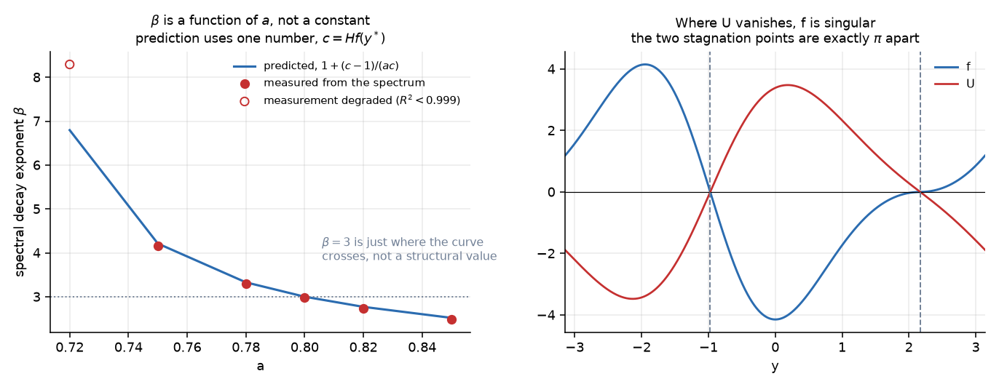
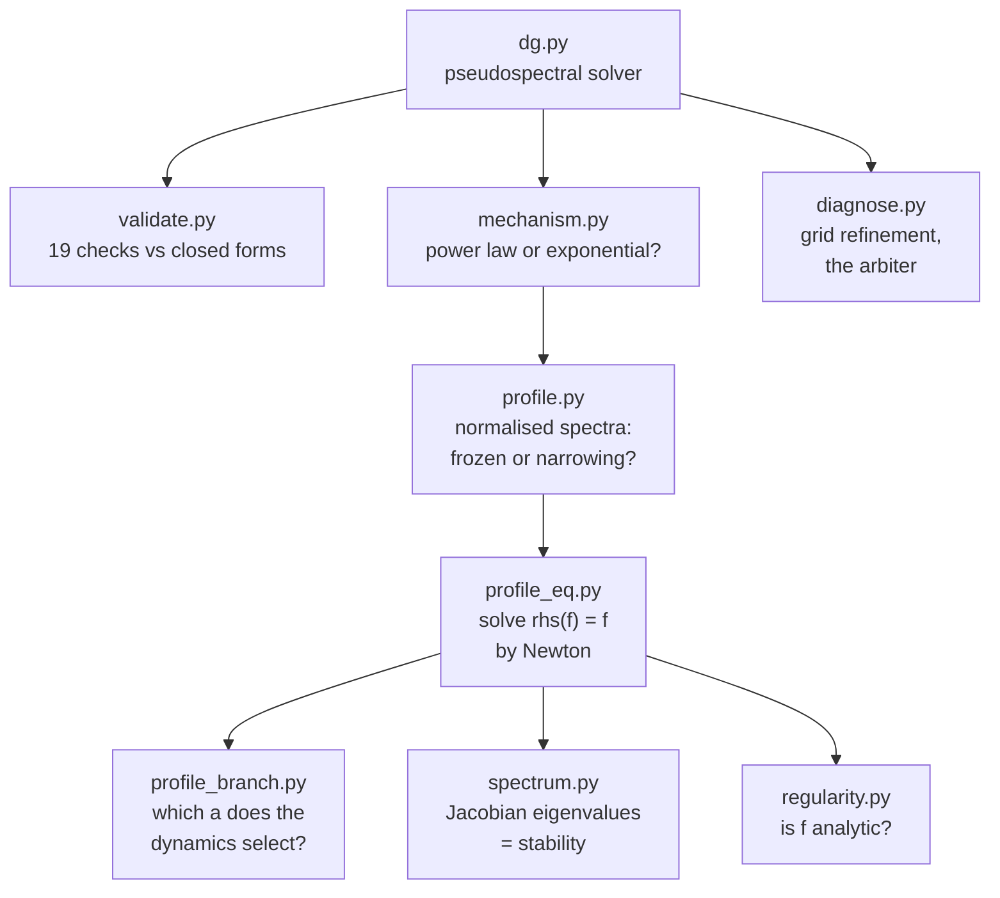

# De Gregorio blowup

[](https://github.com/munawarkazmi/degregorio-blowup/actions/workflows/validate.yml)

> Everything here blows up in finite time, including the author. Fittingly,
> most of the damage came from fitting: twice this repo handed me
> `R^2 = 0.99` on a model of the wrong shape, and twice I fell for it. I also
> refuted one of my own exact identities before noticing the refutation was a
> cancellation error. Finding 10 retracts finding 9, finding 19 retracts
> finding 11, and a literature search took most of the rest.

A pseudospectral solver and profile analysis for the Okamoto, Sakajo and Wunsch
family of 1D models for the 3D Euler vorticity equation, on the circle:

```
w_t + a u w_x = w u_x
u_x = H w,   mean(u) = 0
```

`H` is the Hilbert transform, and `a` tunes how much advection fights vortex
stretching. This family isolates the one thing that makes 3D Euler hard.
Stretching (`w u_x`) drives blowup; advection (`a u w_x`) fights it by carrying
the growing peak out of the straining region. At `a = 0` the fight is over
before it starts and there is a closed-form singularity. At `a = 1` the two
terms are in real competition, and that competition is the 1D shadow of the
Euler problem.

**Both endpoints are known exactly**, which is what makes everything here
checkable:

| `a` | model | exact fact |
| --- | --- | --- |
| 0 | Constantin, Lax and Majda (1985) | `w = 4 w_0 / [(2 - t H w_0)^2 + t^2 w_0^2]`, so from `sin x` the blowup time is `T = 2` and the rate exponent is 1 |
| 1 | De Gregorio (1990) | `sin x` is a steady state, since `u w_x = w u_x` pointwise, so `T` is infinite |

**Most of what follows is known, and the sections below say whose it is.** The
frozen blowup profile studied here was found numerically by Lushnikov,
Silantyev and Siegel (2020), and its existence, nonlinear stability and local
exponent near `a = 1` were proved by Chen (2021). What this repo adds is a way
of reading one constant off a discrete profile accurately, which turns a fitted
spectral exponent into a computed one. The full accounting, with twelve
references and an explicit statement of what is not mine, is in the
introduction of [paper/degregorio.pdf](paper/degregorio.pdf).

## Quick start

```bash
pip install numpy matplotlib
```

```bash
python validate.py
```

19 checks in about 35 seconds, every one against a closed form or a conserved
quantity, and the same run is what the badge above reports. Then:

```bash
python mechanism.py && python profile_branch.py && python spectrum.py
```

## Results at a glance


Blowup for every `a < 1` with rate exponent 1, and `T(a)` running away as
`a` approaches 1. No transition to global existence appears below `a = 1`.

| `a` | 0 | 0.2 | 0.4 | 0.5 | 0.6 | 0.7 | 0.8 | 0.9 | 0.95 | 1 |
| --- | --- | --- | --- | --- | --- | --- | --- | --- | --- | --- |
| `T` | 2 exact | 2.3101 | 2.7858 | 3.1416 | 3.6500 | 4.4641 | 6.0719 | 10.757 | 17.713 | inf exact |
| `p` | 1 exact | 0.997 | 1.000 | 1.001 | 1.001 | 0.999 | 1.000 | 1.049 | unreliable | n/a |

### Two structurally different blowups

The split into a narrowing and a frozen regime is Lushnikov, Silantyev and
Siegel's, who sweep `a` at high precision and locate the changeover at
`a_c = 0.6890665337007457...`. What follows reproduces it rather than
establishing it.


Comparing normalised spectra `|w_k| / max|w_k|` across decades of amplitude
growth is translation invariant and assumes nothing about the shape. At
`a = 0.8` the curves lie on top of one another: the profile is frozen and only
its height diverges. At `a = 0.4` they spread: the peak is narrowing.

| | small `a` | large `a` |
| --- | --- | --- |
| behaviour | peak narrows | profile freezes |
| spectra across 4 decades | move by 0.72 in one decade | converge to 3.8e-3 and stop |
| peak location | drifts | locks to `x = 2.16699` |
| resolvability | exhausted by `\|\|w\|\| = 5.8e3` | tail stays at 2.7e-17 to `\|\|w\|\| = 1e6` |

### The blowup profile solves a fixed point equation

The ansatz is not new. `w = f(x - x_p) / (T - t)`, with no spatial rescaling,
is the frozen profile of Lushnikov, Silantyev and Siegel, and Chen proved that
it exists for `a` near 1, with an odd profile. The general self similar profile
equation, of which this is the case with no width exponent, is standard and
appears in Xu and in Huang, Tong and Wang. What is below is a check that the
frozen case reduces to a fixed point of the solver's own nonlinearity, which is
what makes it cheap to solve to high accuracy.

Substituting `w = f(x - x_p) / (T - t)` gives `f / (T-t)^2` on the left and
`rhs(f) / (T-t)^2` on the right, so the profile equation is just

```
rhs(f) = f
```

a fixed point of the same nonlinearity the solver already validates. It has no
free scaling, since `cf` gives `c^2 rhs(f) = c^2 f`, which equals `cf` only at
`c = 1`. **The equation fixes the amplitude**, and because
`d/dt (1/||w||) = -1/||f||_inf`, that amplitude is independently measurable
from a simulation.


At `a = 0.8` the simulated profile satisfies `rhs(f) = f` to 1.3e-5 before
Newton runs at all. The two computations, time marching a PDE and Newton on an
algebraic fixed point, share nothing but the value of `a`:

| `N` | simulation slope | profile equation | agreement |
| --- | --- | --- | --- |
| 2048 | 4.148459148 | 4.148481857 | 5.5e-6 |
| 4096 | 4.154779433 | 4.154737187 | 1.0e-5 |

### The profile is linearly stable, and that is why it is selected

Chen proved nonlinear stability, and asymptotic self similarity from smooth
data, for `a` in a neighbourhood of 1. The computation below is at `a = 0.8`,
outside that neighbourhood, and it is numerical where his is a theorem. Xu asks
the same question for the `a = 0` profile on the line and answers it with
proof, finding the same two symmetry modes and a spectral gap.

Renormalising with `s = -ln(T - t)` and `W = (T - t) w` turns the equation into
`W_s = rhs(W) - W`, so the profile is a fixed point and **the Jacobian
eigenvalues are growth rates in renormalised time, directly**.


Two eigenvalues are forced by symmetry. The `lambda = 1` mode is provable, not
fitted: `rhs` quadratic gives `D[rhs](f) f = 2 rhs(f) = 2f`, hence `J f = f`.

| eigenvalue | eigenvector | meaning | verified to |
| --- | --- | --- | --- |
| exactly 1 | `f` | freedom to shift the blowup time | 1.3e-12 |
| exactly 0 | `f'` | translation invariance | 4.0e-11 |

Everything else lies in the left half plane at `N = 512`, 1024 and 2048 alike.
Zero unstable directions beyond the two forced modes.

### The profile has finite regularity

Also known. Lushnikov, Silantyev and Siegel observe that `f` has a jump in a
high order derivative at the point antipodal to the singularity, which at
`a = 0.8` is a jump in `f''`, and they measure the algebraic spectral decay it
produces, reporting the exponent as `p_b`. Chen proves the profile is `C^1` but
not `C^{1,alpha}` there. The section below arrives at the same place from the
profile equation.

The shape looks harmless: broad, exactly odd, `max |f'| = 7.04`. But its
spectrum is still at 1e-10 by `k = 900`, which no analytic function that smooth
would do. Fitting both laws over the same window:

| `N` | exponential `R^2` | algebraic `R^2` | `beta` |
| --- | --- | --- | --- |
| 1024 | 0.827 | **0.981** | 3.044 |
| 2048 | 0.805 | **0.983** | 3.048 |
| 4096 | 0.788 | **0.984** | 3.045 |

The algebraic law wins at every resolution, so the profile has finite
regularity and nothing read off it converges spectrally.

### And `beta` is not a constant. It is predicted by one local number

The relation `mu = (c - 1) / (a c)` is Chen's. It is stated in his Theorem 1 as
the Holder exponent of the profile's derivative, and the two forms differ only
by the normalisation `c_w = -1` and one line of algebra. It was derived
independently here, and finding 19 records how long that took to discover.

Rearranging the profile equation gives `f'/f = (Hf - 1)/(a U)`, so `f` can only
be singular where the velocity `U` vanishes. Setting `U(y*) = 0` forces
`f(y*) = 0` too, confirmed to 5e-15. Expanding around such a point with
`c = Hf(y*)`:

```
f ~ C (y - y*)^mu,   mu = (c - 1) / (a c),   so   beta = 1 + (c - 1) / (a c)
```



At `a = 0.8` this gives `mu = 2.0017`, so `f` is `C^1,1` but not `C^2` and
`f''` jumps. Measured: `f''` is exactly odd about `y*` to 1e-9, bounded at
`+2.27045` and `-2.27045`, a jump of 4.54089. A jump in the second derivative
gives `k^-3` exactly.

Predicting `beta` from that one number and measuring it independently from the
spectrum, across a range where the predictions span 4.2 to 2.5:

| `a` | 0.75 | 0.78 | 0.80 | 0.82 | 0.85 |
| --- | --- | --- | --- | --- | --- |
| predicted | 4.213 | 3.329 | 3.002 | 2.770 | 2.520 |
| measured | 4.167 | 3.305 | 2.976 | 2.741 | 2.483 |
| rel diff | 0.011 | 0.007 | 0.009 | 0.011 | 0.015 |

Those measurements are about 1 percent low at every `a`, systematically rather
than randomly, and the cause is the fit window rather than the formula. Fitting
octave by octave, the local slope falls straight through the prediction instead
of converging to it:

| band | 8 to 32 | 32 to 128 | 64 to 256 | **128 to 512** | 256 to 1024 |
| --- | --- | --- | --- | --- | --- |
| `beta` | 3.164 | 3.046 | 3.030 | **3.00315** | 2.973 |

The two ends are biased in opposite directions, so any window spanning both
lands in between. Refining `N` separates them, because discretisation sits at a
fixed fraction of `k_cut` and slides right as `N` grows while real structure
sits at a fixed absolute `k`. Aligned by `k / k_cut` the high end matches
across resolutions, 2.789 against 2.794 at 0.75 and 2.972 against 2.976 at
0.375, so the droop is the dealiasing mask. Aligned by absolute `k` the low end
matches instead, 3.046 against 3.053 over 32 to 128, so that bias is the
analytic factor multiplying `|y-y*|^mu`, which contributes `k^-(mu+2)` and
faster. Both effects identified, neither is the `k^-2` term that looked
obvious: `f'` is continuous at both stagnation points to 4e-12.

The clean window is where both are small, near `k / k_cut = 0.19`, and there
`N = 4096` and `N = 8192` give 3.00303 and 3.00291 against a predicted
3.001668.

**Do not read that as agreement to 0.04 percent.** It is reproducibility, not
accuracy. Applying the same window to the same estimator on two similar spectra
returns the same biased answer, which says nothing about how close either is to
the truth. Shifting the window from `128 to 512` across to
`0.094 to 0.375 k_cut`, the same window to three digits, moves the answer from
3.00315 to 2.98626. Across ten reasonable windows:

| estimator | range | spread |
| --- | --- | --- |
| binned, RMS per bin | 2.9829 to 3.0072 | 2.4e-2 |
| raw, every mode | 3.0132 to 3.0510 | 3.8e-2 |

Unbinning hurts rather than helps, and biases the other way, since RMS binning
is energy weighted while an unbinned log fit is a geometric mean. So the honest
figures are:

| quantity | value | limited by |
| --- | --- | --- |
| `beta` predicted | 3.002 +/- 0.005 | resolution, `f` is only `C^1,1` |
| `beta` measured | 3.00 +/- 0.02 | choice of estimator and window |

They agree, and nothing finer is resolvable here. The prediction is the better
number of the two by a factor of four, so the spectral fits do not confirm the
formula so much as fail to contradict it.

So the regularity of the blowup profile varies continuously with `a`, and
`beta = 3` is just where that curve happens to cross. The earlier reading of a
constant 3.045 came from measuring at one value of `a`, with a wide fit window
biased by beating: the two stagnation points sit exactly `pi` apart, which makes
`|f_k|` alternate with period 2 in `k`.

### Half of `c` is exact, and needs three lines rather than a computation

This one is a normalisation identity, not a result, and it was already in print
four times over: Chen's (2.8), where it is the gauge fixing the time rescaling;
(2.10) of Huang, Tong and Wang; page 17 of Xu; and the same algebra in Theorem
1 of Lushnikov, Silantyev and Siegel, applied to the leading complex
singularity. It matters here only because the next section needs a quantity
whose exact value is known.

There are two stagnation points. Where `f` has a **simple** zero at one, put
`U ~ c(y-y_1)`, `f ~ A(y-y_1)` with `A` nonzero, and `Hf ~ c`. Then
`a U f' = f(Hf - 1)` reads `a c A (y-y_1) = A (y-y_1)(c-1)` at leading order,
so dividing by `A(y-y_1)`:

```
a c = c - 1        hence        c = 1 / (1 - a)
```

which is `mu = 1`. Measured deviations of `mu` from 1 at that point:

| `a` | 0.70 | 0.72 | 0.74 | 0.76 | 0.78 | 0.80 |
| --- | --- | --- | --- | --- | --- | --- |
| `mu - 1` | -1.7e-15 | -4.6e-14 | -2.0e-10 | 3.5e-8 | 5.6e-6 | 8.5e-5 |

Machine precision. The same balance at the other stagnation point reproduces
the general formula, so `mu = 1` is just the case where `f` is smooth there.
That point therefore carries no singularity, and `beta` is set entirely by the
other one, whose `c` stays genuinely global.

No closed form for that one came out of the data. `1/mu2` runs 0.0651, 0.1726,
0.2676, 0.3526, 0.4294, 0.4996, 0.5648, 0.6272 across `a` from 0.70 to 0.84,
smooth and monotone but convex, with its slope falling from 5.37 to 3.12. A
straight line fits at `R^2 = 0.991` and extrapolates uselessly: two different
windows put the point where the profile turns analytic at `a = 0.662` and
`a = 0.649`. Same trap as the biased `beta` above, a high `R^2` on a model of
the wrong shape.

### Getting `c2` to five digits anyway

**This is the part that is new.** Everything above is setting, and the setting
belongs to the references named in it. The constant those references leave open
is `c2`, and reading it off a discrete profile is the whole difficulty: across
seven resolutions it wanders by 2e-2 with no monotone trend, so extrapolating
in `N` returns noise.

`c1 = 1/(1-a)` exactly, so its measured wander across resolutions is a direct
gauge of the discretisation error in reading anything off the profile. `c2`
comes off the same profile and carries the same error linearly, so regressing
`c2` against `c1` and evaluating at the exact `c1` cancels it. At `a = 0.8`
over `N` = 512 to 4096 the regression is `c2 = -0.980361 c1 + 3.240505` at
`R^2 = 0.99999744`, and the raw spread of 1.95e-2 collapses to 2.43e-5, a
factor of **801**. Even `N = 512` then lands within 1.5e-5 of `N = 4096`.

```
c2   = -1.66130027 +/- 1.0e-05
mu2  =  2.00242268 +/- 4.6e-06
beta =  3.00242268
```

**So `beta = 3` is excluded.** `mu2 = 2` would need `c2 = 1/(1-2a) =
-1.66666667`, and the corrected value misses it by 5.37e-3, some 500 times the
scatter of the corrected points. The spectral measurement of `beta` is good
only to 2e-2 and no longer matters to the answer.

It also corrects a published number. At `a = 0.71`, where Lushnikov, Silantyev
and Siegel fit `p_b = 9.32592` to the spectrum, the same procedure gives
`beta = 9.29546`, a correction of 0.33 percent. The two determinations share no
machinery: theirs is a least squares fit over a band of wavenumbers, this is a
single value of `H f` read off the profile.

**The assumption underneath it is that the discretisation error enters `c1` and
`c2` linearly with the same coefficient.** That has been tested. Align the
profiles on their stagnation point, difference them across resolutions, and the
singular values of the stack are 9.97e-1, 4.70e-4, 3.79e-5 and smaller: the
error is a single fixed shape carrying 0.99999978 of the variance, whose
amplitude alone depends on `N`. Every linear functional of a rank one error is
proportional to every other, so `c1` and `c2` have to fall on a line and there
is nothing special about that pair. Inducing the error a different way, by
varying the dealiasing fraction at fixed `N`, moves the slope by 2.0e-3 and the
corrected `c2` by 1.5e-6.

Two attempts to check it against something exact both failed, for the same
reason and instructively. The `PV` constraint below holds by symmetry, so it
carries no discretisation error and cannot anchor anything. A manufactured
solution, built with the right structure and an exact source term, pins the
smooth point so hard that the anchor is 8500 times quieter than the target and
there is nothing to regress. A control variate needs its anchor to carry the
target's error, and neither of those does. `cv_second_anchor.py` and
`cv_manufactured.py` are the two negative results and the three that worked.

### The equation integrates once, and `c2` has no closed form

From `f'/f = (U' - 1)/(aU)`, on each interval between zeros of `U`,

```
f = C |U|^(1/a) exp( -(1/a) integral dy/U )
```

Requiring `f` to close up around the circle then forces an exact constraint,
`PV integral of dy/U = 0`, verified to 1e-12 at four values of `a` and three
independent grid shifts. Neither the first integral nor the constraint was
found in Chen, in Huang, Tong and Wang, or in targeted searches, and both are
elementary once the profile ODE is separated, which nobody there does. Given
what finding 18 cost, read "not found" as not found rather than as new. A
principal value integral of this shape is in any case not new to the model:
Jia, Stewart and Sverak have one as an orbit invariant at `a = 1`, over the
vorticity rather than the velocity, saying that it is conserved rather than
that it vanishes. Nothing is claimed here for the form, only for its value.

No closed form for `c2` emerged. With `c2` mapped across eleven values of `a`
it is now precise enough to **exclude** shapes rather than fail to confirm
them: every Mobius form, in `a` and in `1/(1-a)`, for both `c2` and `mu2`, is
out by one to two orders of magnitude above the data's precision.

That is probably the right answer rather than a gap. `c1` is exact because it
comes from a local balance where `f` is smooth; `c2` has no such balance, so
its value is set by the global solution. Pinning it in closed form would mean
solving the nonlocal problem, whose obstruction is explicit: with `psi` the
positive frequency part the equation reads
`a(psi + psi~)(psi'' - psi~'') = (psi' - psi~')(psi' + psi~' - 1)`, and the
mixed products straddle both halves of the spectrum. If `c2` were elementary,
De Gregorio would not be hard.

Full detail, including what is not settled and every retraction in order, is in
[FINDINGS.md](FINDINGS.md). The technical write up is
[paper/degregorio.pdf](paper/degregorio.pdf), source in
[paper/degregorio.tex](paper/degregorio.tex); its introduction is the place
where the attribution is done properly.

If none of the above meant anything to you, start here instead:
**[Sharper, or taller?](docs/explainer/degregorio-blowup-explained.pdf)**, six
pages, no mathematics assumed. It covers the same results and the same
retractions, and explains what a blowup is before claiming to have measured
one.

```bash
cd paper && pdflatex degregorio.tex && pdflatex degregorio.tex
```

## How the pieces fit together



## Files

This is a lab notebook, not a library. Five files carry the machinery and the
rest are one experiment each, named after the question they were written to
answer. Every one has a docstring saying what it was for and, where it applies,
how it went wrong.

**Machinery**

| file | what it does |
| --- | --- |
| `dg.py` | solver, spectral operators, diagnostics, exact solutions |
| `validate.py` | 19 checks against closed forms and conserved quantities |
| `profile_eq.py` | the profile equation `rhs(f) = f` and its Newton solver |
| `diagnose.py` | grid refinement study, for when a result looks too good |
| `figures.py` | regenerates the figures above |

**The sweep, and the two regimes** (findings 1 and 2)

| file | what it does |
| --- | --- |
| `sweep.py` | the `T(a)` experiment, writes `sweep.csv` |
| `mechanism.py` | growth law: power law versus exponential |
| `profile.py` | normalised spectra, the frozen versus narrowing test |
| `profile_branch.py` | which `a` the dynamics selects a profile for |
| `profile_unique.py` | one solution per grid, or several |
| `check_strip.py` | control test for `strip_width` against the one exact case |
| `critical.py` | how `T` diverges as `a` approaches 1 |

**The exponent `beta`** (findings 6, 7, 9 and 10)

| file | what it does |
| --- | --- |
| `regularity.py` | is the profile analytic, and how smooth is it |
| `beta.py` | local spectral slope by octave, binned over the beating |
| `beta_theory.py` | derives `beta` from the stagnation points |
| `beta_jump.py` | the jump in `f''`, and whether `mu = 2` is structural |
| `beta_predict.py` | predicted against measured `beta` across `a` |
| `beta_log.py` | the resonant case: is `beta` exactly 3, with a logarithm |
| `beta_lss.py` | our `beta` against the one published value we can pin, at `a = 0.71` |
| `shortfall.py` | where the 1 percent shortfall in measured `beta` comes from |
| `shortfall2.py` | the check that proves the shortfall is a fit window artefact |
| `residual.py`, `residual2.py`, `residual3.py` | chasing the 1.3e-3 residual, and finding it was the measurement |

**The constants, and the control variate** (findings 8, 12 and 13)

| file | what it does |
| --- | --- |
| `c_of_a.py`, `c_of_a2.py` | what sets `c = H f(y*)`, across `a` |
| `c2_solve.py` | `c2` by refinement and extrapolation, which returns noise |
| `c2_control.py` | `c2` using `c1` as a control variate, the main result |
| `c2_now.py` | the correction applied to an existing table, no solves |
| `c2_form.py` | hunting a closed form for `c2`, and excluding shapes |
| `cv_second_anchor.py` | does the control variate survive a second anchor: no, `PV` carries no error |
| `cv_manufactured.py` | the rank of the error, a held out split, a second knob, and a manufactured solution that cannot score it |
| `pv_test.py` | the `PV` identity again, off grid |

**Stability, symmetry and the critical limit** (findings 5, 11, 15 and 16)

| file | what it does |
| --- | --- |
| `spectrum.py` | Jacobian eigenvalues, linear stability |
| `parity.py` | the parity calculation, and what it actually predicts |
| `parity_check.py` | is the profile odd about a shifted point: yes, so finding 11 is empty |
| `neutral.py`, `neutral2.py` | the linearisation about the ground state, and whether its growth is drift |
| `manifold.py` | why mode truncation converges slowly, and what sets the escape time |
| `dilation.py` | the profile family `f(nx)`, and two loose ends from `generic.py` |
| `exchange.py`, `exchange2.py` | the exchange of stability hypothesis, and where the branches merge |
| `merger_fit.py` | locating that merger from the measured `c_l` table |

**The basin** (finding 14)

| file | what it does |
| --- | --- |
| `generic.py` | does any of this depend on starting from `sin x` |
| `basin.py` | maps the basin of the frozen profile at `a = 0.8` |
| `basin_anomaly.py` | why one datum did not blow up |
| `basin_decay.py`, `basin_decay2.py` | is the decaying case a separatrix or a third outcome |
| `decay_profile.py`, `decay_shape.py` | what the decaying solution decays to, and whether it is self-similar |

**The exact `a = 1/2` case** (findings 3 and 17)

| file | what it does |
| --- | --- |
| `pi_check.py` | whether `T(1/2) = pi` survives refinement |
| `pi_exact.py` | the proof that it is exact, and the check |
| `pi_stagnation.py` | the stagnation point relation against the exact solution |

**Documents**

| file | what it does |
| --- | --- |
| `paper/` | the technical write up, source and PDF |
| `docs/explainer/` | the plain-language guide, source and PDF |
| `arxiv_package.py` | assembles a flat arXiv tarball and refuses to write it unless it builds clean |
| `explainer_figure.py`, `explainer_figure2.py` | the two figures used only by that guide |

`profile_solve.py`, `profile_refine.py` and `shape_check.py` are earlier passes,
kept because their working parts stand and their failures are instructive: the
first fell into the trivial solution `f = 0` while continuing in `a`, and the
second chased a grid maximum artefact that turned out not to be one.

## Numerics

Pseudospectral in space, products formed on the grid with 2/3 dealiasing and
the Nyquist mode zeroed. Classical RK4 in time, with two constraints on the
step:

- **Accuracy.** `dt = cfl / max(|u_x|, |w|)`. Stretching drives the growth, so
  the step must shrink like `1 / ||w||` as the peak sharpens.
- **Stability.** The advective term has eigenvalues out to `i a u k_cut`, and
  RK4 is stable on the imaginary axis only to 2.828, so
  `dt < c_adv / (k_cut |a| u_max)`.

Getting that second bound wrong is expensive in a way that looks like nothing.
The finite difference instinct, `dt = cfl dx / u_max`, is about 67 times
smaller than necessary at `cfl = 0.02`, and it applies a penalty at `a = 0`
where the advection term is not present at all. Runs that should take ten
seconds take ten minutes and still produce correct answers, so nothing appears
to be wrong.

Three diagnostics deserve their own note, because each was wrong at first in a
way that produced plausible numbers:

| diagnostic | the trap |
| --- | --- |
| `sup_norm` | the grid maximum is wrong by `O(dx^2 f'')`, and near blowup the peak narrows like `1/||w||`, so the error grows exactly when it matters. Newton on `f'(x) = 0` against the interpolant fixes it for `O(N)` per point |
| `strip_width` | fitting the decay rate over the whole upper band measures the roundoff plateau, not the decay. Restricting to genuinely decaying decades fixes that, but see `regularity.py`: for `a > 0` there is no exponential to fit in the first place |
| `tail_energy_fraction` | calibrated on `a = 0`, where the spectrum is exponential. It is not a reliable guard for algebraically decaying spectra |

`w_max` defaults to 1e8 because that is where the clock runs out, not the
physics. Near a power law singularity `dt ~ cfl / ||w||` while `t` is of order
`T`, so `t + dt` stops meaning anything once `cfl / ||w|| < eps T`, around
`||w|| = 1e13`.

### Fitting a blowup

If `w ~ C (T - t)^-p` then `w / (dw/dt) = (T - t) / p`, a straight line in `t`
with slope `-1/p` and root `T`. One regression gives both numbers and the
residual says whether the power law fits at all.

The window matters more than the regression. A power law is only the leading
asymptotics, so any window of finite width in `t` carries an `O(width)` bias.
`fit_blowup` selects by amplitude rather than record fraction, and the honest
way to quote a result is two window sizes with the trend shown. On the exact
`a = 0` data, one decade gives `T = 1.99998, p = 0.9946` and half a decade
gives `T = 1.999997, p = 0.9981`.

## What is checked

| # | check | result |
| --- | --- | --- |
| 1 | `sin x` steady at `a = 1` over `t = 50` | 4e-13 |
| 2 | `a = 0` against the CLM closed form at `t = 1.8` | 2e-11 field, 6e-12 sup |
| 3 | mean vorticity conserved, `a` in `{0, 0.5, 1, -0.5}` | 1e-16 |
| 4 | spatial convergence follows `exp(-0.2887 k_cut)` | across four orders |
| 5 | time convergence is fourth order | ratios 16.65, 16.28, 16.16, 16.07 |
| 6 | resolution guard calibrated, not assumed | 1e-3 tighter buys 65x then 123x |
| 7 | strip width against `arccosh((4 + t^2)/4t)`, and `w * delta -> 1/2` | 3e-5, and 0.50254 |

## Caveats

`sin x` is not a generic datum. It is exactly the `a = 1` ground state, so the
`T(a)` sweep describes how that ground state destabilises when advection is
weakened, which is narrower than "when does this family blow up". The profile
is less exposed to this: finding 14 reaches it from sixteen random data, from a
continuous family of offsets and from three designed data, always with the same
constants to seven digits. The shape of the basin boundary is still unmapped.

Most of this is known, and the check that established that was expensive.
Findings 18 and 19 are the record of it: twelve papers read, the frozen
profile, its stability, its local exponent and its regularity all found already
in print, one finding retracted as a corollary of the initial datum's symmetry,
and the surviving core reduced to the control variate, the two constants it
corrects, the linear spectrum at `a = 0.8`, the first integral with its `PV`
constraint, and `T(1/2) = pi`. The sections above say whose each piece is; the
introduction of the paper does it properly, with references. Anything here that
is still described as new should be read as not found rather than as absent.

Nothing here is a proof. A computer assisted proof in this area, in the style
of Chen and Hou, needs interval arithmetic producing certified enclosures, not
floating point plus convergence studies. This is the instrument you use to find
the scenario worth trying to prove, and the objects it has produced, a profile
equation with a stable solution, are the objects such a proof would need to
enclose.

## License

MIT, see [LICENSE](LICENSE). If you use the solver or the control variate,
a citation of the paper is welcome but not required.
