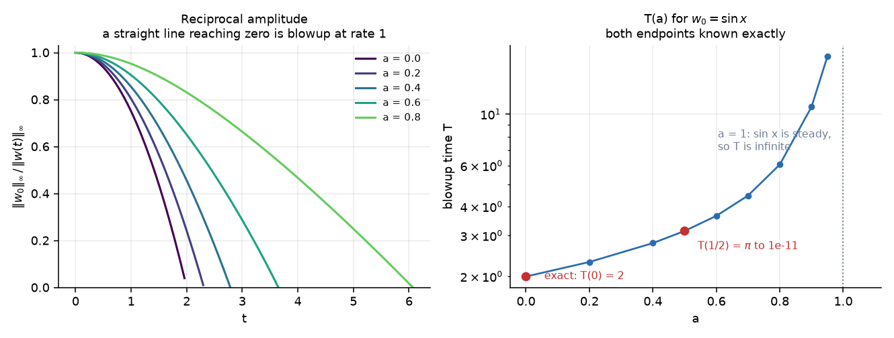
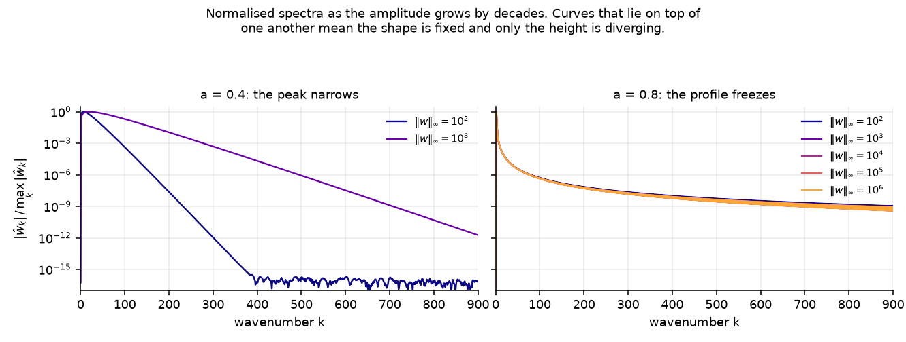
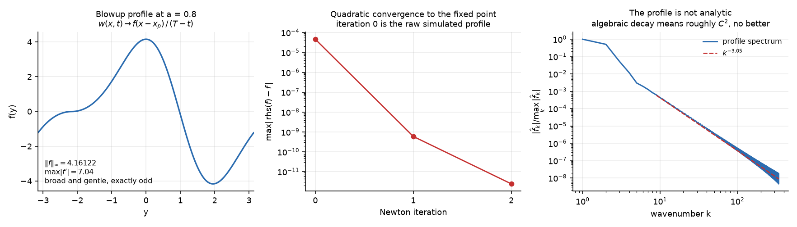
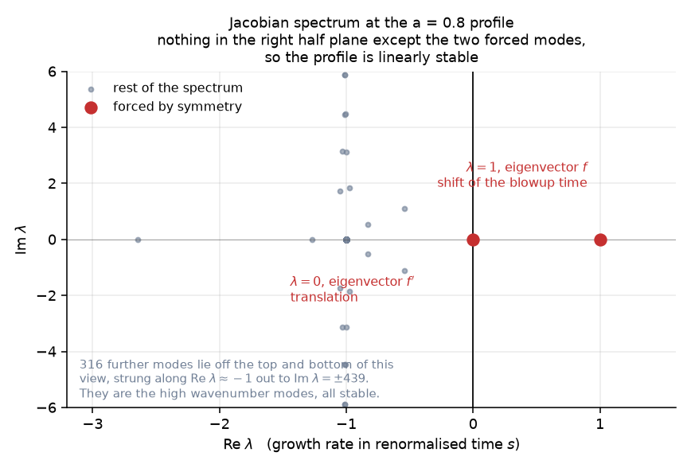
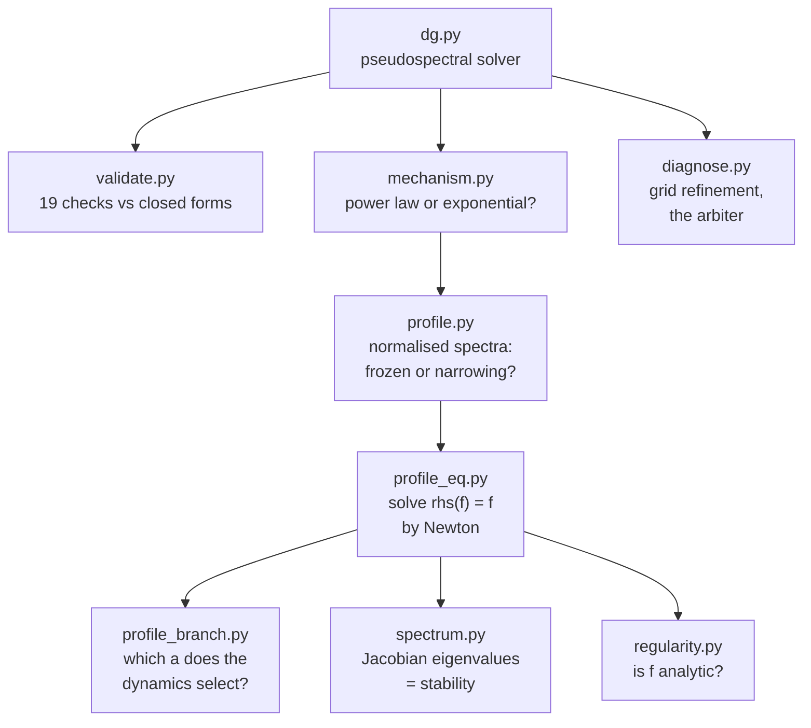

# De Gregorio blowup

A pseudospectral solver and profile analysis for the Okamoto, Sakajo and Wunsch
family of 1D models for the 3D Euler vorticity equation, on the circle:

```
w_t + a u w_x = w u_x
u_x = H w,   mean(u) = 0
```

`H` is the Hilbert transform, and `a` tunes how much advection fights vortex
stretching. This family isolates the one thing that makes 3D Euler hard.
Stretching (`w u_x`) drives blowup; advection (`a u w_x`) fights it by carrying
the growing peak out of the straining region. At `a = 0` the fight is over
before it starts and there is a closed-form singularity. At `a = 1` the two
terms are in real competition, and that competition is the 1D shadow of the
Euler problem.

**Both endpoints are known exactly**, which is what makes everything here
checkable:

| `a` | model | exact fact |
| --- | --- | --- |
| 0 | Constantin, Lax and Majda (1985) | `w = 4 w_0 / [(2 - t H w_0)^2 + t^2 w_0^2]`, so from `sin x` the blowup time is `T = 2` and the rate exponent is 1 |
| 1 | De Gregorio (1990) | `sin x` is a steady state, since `u w_x = w u_x` pointwise, so `T` is infinite |

## Quick start

```bash
pip install numpy matplotlib
```

```bash
python validate.py
```

19 checks in about 35 seconds, every one against a closed form or a conserved
quantity. Then:

```bash
python mechanism.py && python profile_branch.py && python spectrum.py
```

## Results at a glance



Blowup for every `a < 1` with rate exponent 1, and `T(a)` running away as
`a` approaches 1. No transition to global existence appears below `a = 1`.

| `a` | 0 | 0.2 | 0.4 | 0.5 | 0.6 | 0.7 | 0.8 | 0.9 | 0.95 | 1 |
| --- | --- | --- | --- | --- | --- | --- | --- | --- | --- | --- |
| `T` | 2 exact | 2.3101 | 2.7858 | 3.1416 | 3.6500 | 4.4641 | 6.0719 | 10.757 | 17.713 | inf exact |
| `p` | 1 exact | 0.997 | 1.000 | 1.001 | 1.001 | 0.999 | 1.000 | 1.049 | unreliable | n/a |

### Two structurally different blowups



Comparing normalised spectra `|w_k| / max|w_k|` across decades of amplitude
growth is translation invariant and assumes nothing about the shape. At
`a = 0.8` the curves lie on top of one another: the profile is frozen and only
its height diverges. At `a = 0.4` they spread: the peak is narrowing.

| | small `a` | large `a` |
| --- | --- | --- |
| behaviour | peak narrows | profile freezes |
| spectra across 4 decades | move by 0.72 in one decade | converge to 3.8e-3 and stop |
| peak location | drifts | locks to `x = 2.16699` |
| resolvability | exhausted by `\|\|w\|\| = 5.8e3` | tail stays at 2.7e-17 to `\|\|w\|\| = 1e6` |

### The blowup profile solves a fixed point equation

Substituting `w = f(x - x_p) / (T - t)` gives `f / (T-t)^2` on the left and
`rhs(f) / (T-t)^2` on the right, so the profile equation is just

```
rhs(f) = f
```

a fixed point of the same nonlinearity the solver already validates. It has no
free scaling, since `cf` gives `c^2 rhs(f) = c^2 f`, which equals `cf` only at
`c = 1`. **The equation fixes the amplitude**, and because
`d/dt (1/||w||) = -1/||f||_inf`, that amplitude is independently measurable
from a simulation.



At `a = 0.8` the simulated profile satisfies `rhs(f) = f` to 1.3e-5 before
Newton runs at all. The two computations, time marching a PDE and Newton on an
algebraic fixed point, share nothing but the value of `a`:

| `N` | simulation slope | profile equation | agreement |
| --- | --- | --- | --- |
| 2048 | 4.148459148 | 4.148481857 | 5.5e-6 |
| 4096 | 4.154779433 | 4.154737187 | 1.0e-5 |

### The profile is linearly stable, and that is why it is selected

Renormalising with `s = -ln(T - t)` and `W = (T - t) w` turns the equation into
`W_s = rhs(W) - W`, so the profile is a fixed point and **the Jacobian
eigenvalues are growth rates in renormalised time, directly**.



Two eigenvalues are forced by symmetry. The `lambda = 1` mode is provable, not
fitted: `rhs` quadratic gives `D[rhs](f) f = 2 rhs(f) = 2f`, hence `J f = f`.

| eigenvalue | eigenvector | meaning | verified to |
| --- | --- | --- | --- |
| exactly 1 | `f` | freedom to shift the blowup time | 1.3e-12 |
| exactly 0 | `f'` | translation invariance | 4.0e-11 |

Everything else lies in the left half plane at `N = 512`, 1024 and 2048 alike.
Zero unstable directions beyond the two forced modes.

### The profile has finite regularity

The shape looks harmless: broad, exactly odd, `max |f'| = 7.04`. But its
spectrum is still at 1e-10 by `k = 900`, which no analytic function that smooth
would do. Fitting both laws over the same window:

| `N` | exponential `R^2` | algebraic `R^2` | `beta` |
| --- | --- | --- | --- |
| 1024 | 0.827 | **0.981** | 3.044 |
| 2048 | 0.805 | **0.983** | 3.048 |
| 4096 | 0.788 | **0.984** | 3.045 |

`beta` holds at 3.045 across a 4x range in `N`, while the fitted exponential
rate halves every time `N` doubles, which is what fitting an exponential to a
power law always looks like. So the profile is roughly `C^2` and no better, and
nothing read off it converges spectrally.

Full detail, including what is not settled, is in [FINDINGS.md](FINDINGS.md).

## How the pieces fit together



## Files

| file | what it does |
| --- | --- |
| `dg.py` | solver, spectral operators, diagnostics, exact solutions |
| `validate.py` | 19 checks against closed forms and conserved quantities |
| `profile_eq.py` | the profile equation `rhs(f) = f` and its Newton solver |
| `sweep.py` | the `T(a)` experiment, writes `sweep.csv` |
| `mechanism.py` | growth law: power law versus exponential |
| `profile.py` | normalised spectra, the frozen versus narrowing test |
| `profile_branch.py` | which `a` the dynamics selects a profile for |
| `profile_unique.py` | one solution per grid, or several |
| `spectrum.py` | Jacobian eigenvalues, linear stability |
| `regularity.py` | is the profile analytic, and how smooth is it |
| `pi_check.py` | whether `T(1/2) = pi` survives refinement |
| `diagnose.py` | grid refinement study, for when a result looks too good |
| `figures.py` | regenerates the figures above |

`profile_solve.py`, `profile_refine.py` and `shape_check.py` are earlier passes,
kept because their working parts stand and their failures are instructive: the
first fell into the trivial solution `f = 0` while continuing in `a`, and the
second chased a grid maximum artefact that turned out not to be one.

## Numerics

Pseudospectral in space, products formed on the grid with 2/3 dealiasing and
the Nyquist mode zeroed. Classical RK4 in time, with two constraints on the
step:

- **Accuracy.** `dt = cfl / max(|u_x|, |w|)`. Stretching drives the growth, so
  the step must shrink like `1 / ||w||` as the peak sharpens.
- **Stability.** The advective term has eigenvalues out to `i a u k_cut`, and
  RK4 is stable on the imaginary axis only to 2.828, so
  `dt < c_adv / (k_cut |a| u_max)`.

Getting that second bound wrong is expensive in a way that looks like nothing.
The finite difference instinct, `dt = cfl dx / u_max`, is about 67 times
smaller than necessary at `cfl = 0.02`, and it applies a penalty at `a = 0`
where the advection term is not present at all. Runs that should take ten
seconds take ten minutes and still produce correct answers, so nothing appears
to be wrong.

Three diagnostics deserve their own note, because each was wrong at first in a
way that produced plausible numbers:

| diagnostic | the trap |
| --- | --- |
| `sup_norm` | the grid maximum is wrong by `O(dx^2 f'')`, and near blowup the peak narrows like `1/||w||`, so the error grows exactly when it matters. Newton on `f'(x) = 0` against the interpolant fixes it for `O(N)` per point |
| `strip_width` | fitting the decay rate over the whole upper band measures the roundoff plateau, not the decay. Restricting to genuinely decaying decades fixes that, but see `regularity.py`: for `a > 0` there is no exponential to fit in the first place |
| `tail_energy_fraction` | calibrated on `a = 0`, where the spectrum is exponential. It is not a reliable guard for algebraically decaying spectra |

`w_max` defaults to 1e8 because that is where the clock runs out, not the
physics. Near a power law singularity `dt ~ cfl / ||w||` while `t` is of order
`T`, so `t + dt` stops meaning anything once `cfl / ||w|| < eps T`, around
`||w|| = 1e13`.

### Fitting a blowup

If `w ~ C (T - t)^-p` then `w / (dw/dt) = (T - t) / p`, a straight line in `t`
with slope `-1/p` and root `T`. One regression gives both numbers and the
residual says whether the power law fits at all.

The window matters more than the regression. A power law is only the leading
asymptotics, so any window of finite width in `t` carries an `O(width)` bias.
`fit_blowup` selects by amplitude rather than record fraction, and the honest
way to quote a result is two window sizes with the trend shown. On the exact
`a = 0` data, one decade gives `T = 1.99998, p = 0.9946` and half a decade
gives `T = 1.999997, p = 0.9981`.

## What is checked

| # | check | result |
| --- | --- | --- |
| 1 | `sin x` steady at `a = 1` over `t = 50` | 4e-13 |
| 2 | `a = 0` against the CLM closed form at `t = 1.8` | 2e-11 field, 6e-12 sup |
| 3 | mean vorticity conserved, `a` in `{0, 0.5, 1, -0.5}` | 1e-16 |
| 4 | spatial convergence follows `exp(-0.2887 k_cut)` | across four orders |
| 5 | time convergence is fourth order | ratios 16.65, 16.28, 16.16, 16.07 |
| 6 | resolution guard calibrated, not assumed | 1e-3 tighter buys 65x then 123x |
| 7 | strip width against `arccosh((4 + t^2)/4t)`, and `w * delta -> 1/2` | 3e-5, and 0.50254 |

## Caveats

`sin x` is not a generic datum. It is exactly the `a = 1` ground state, so this
describes how that ground state destabilises when advection is weakened, which
is narrower than "when does this family blow up". `sweep.py --ic tilted` and
`--ic onesigned` exist to test what survives a different datum, and neither has
been run past a smoke test.

Nothing here has been checked against the literature. Okamoto, Sakajo and
Wunsch studied this family numerically in 2008, and Chen, Hou and Huang proved
finite time blowup for De Gregorio on the line with low regularity data in
2021. Several of these findings may well be known.

Nothing here is a proof. A computer assisted proof in this area, in the style
of Chen and Hou, needs interval arithmetic producing certified enclosures, not
floating point plus convergence studies. This is the instrument you use to find
the scenario worth trying to prove, and the objects it has produced, a profile
equation with a stable solution, are the objects such a proof would need to
enclose.
